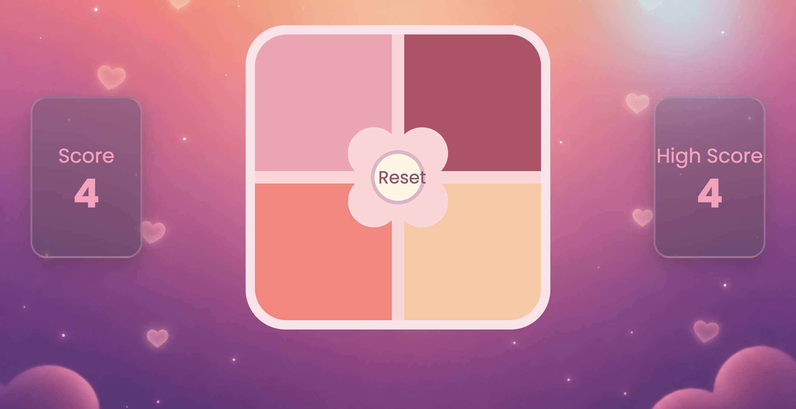

# Simon: Respawned 🌸

> A dreamy little memory game with pastel colors, cozy music, and absolutely no sympathy for your short-term memory.


**Simon: Respawned** is a fresh, playful spin on the classic sequence-memory game. Watch the four colorful pads light up, memorize their order, and repeat the pattern perfectly. Every successful round adds one more step to the sequence—and one more opportunity for your brain to say, “Wait… was it pink or coral?”

Simple to learn. Surprisingly hard to master. Dangerously easy to replay.

## 🎮 How to play

1. Press **Start** and let the music set the mood.
2. Watch carefully as the board flashes a sequence.
3. Click or tap the colored pads in the exact same order.
4. Complete the pattern to earn a point and unlock a longer sequence.
5. Make one wrong move and the run is over. Press **Reset** to prepare the board, then **Start** to try again.

The sequence never flashes the same pad twice in a row, but don't get too comfortable—it still gets delightfully chaotic.

## ✨ What's inside?

- 🧠 **Classic memory gameplay** — repeat an ever-growing color sequence
- 🎯 **Live score tracking** — see exactly how long your memory survives
- 🏆 **Session high score** — your best run stays visible until the page is refreshed
- 🎵 **Background music** — because every dramatic brain battle deserves a soundtrack
- 💡 **Animated feedback** — glowing, flickering pads make each move feel satisfying
- 📱 **Responsive design** — plays nicely on desktops, tablets, and phones
- 🖱️ **Cursor glow** — a soft ambient effect for pointer-based devices
- ♿ **Reduced-motion support** — respects your system motion preferences

## 🚀 Run it locally

You'll need [Node.js](https://nodejs.org/) installed on your machine.

```bash
# Install the dependencies
npm install

# Start the development server
npm run dev
```

Open the local URL shown in your terminal, press **Start**, and prepare to question your own memory.

### Production build

```bash
# Create an optimized build
npm run build

# Preview the production build locally
npm run preview
```

## 🛠️ Built with

- **HTML5** for the game board and accessible controls
- **CSS3** for the responsive layout, pastel styling, glow effects, and animations
- **Vanilla JavaScript** for game state, sequence generation, scoring, and audio
- **Vite** for a fast development server and optimized production builds

No UI framework. No game engine. Just browser APIs, a little logic, and four suspiciously charming buttons.

## 🗂️ Project map

```text
.
├── assets/
│   ├── backgroundImage.png   # Dreamy game backdrop
│   └── music.mp3            # Background soundtrack
├── index.html               # Game interface
├── script.js                # Gameplay and scoring logic
├── styles.css               # Layout, colors, and animations
└── package.json             # Scripts and dependencies
```

## 🧪 The one-line strategy guide

Focus, breathe, and definitely don't blink when the sequence starts.

---

Made with 🎀, JavaScript, and the stubborn belief that _the next run will be the one_.

---


